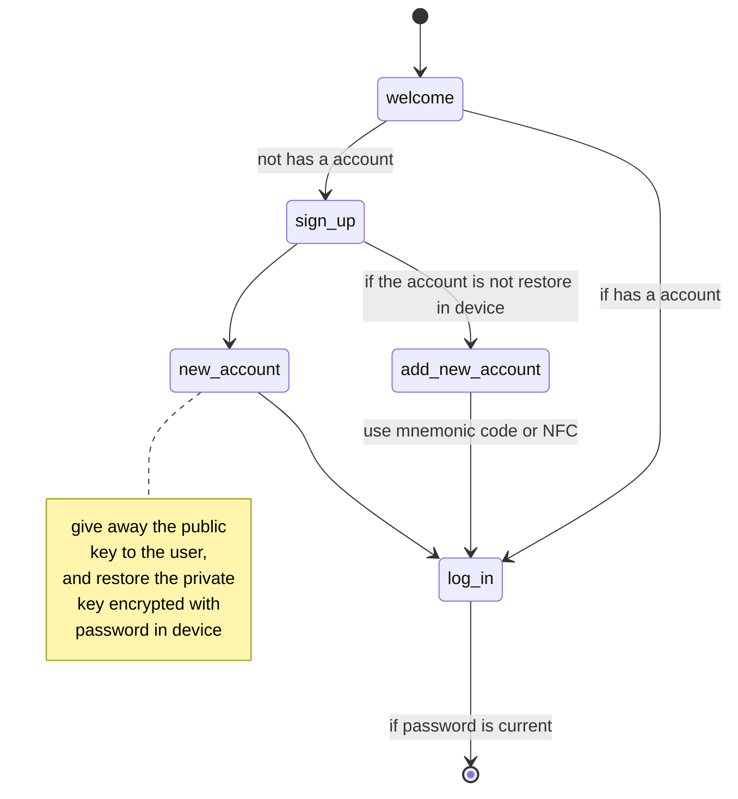
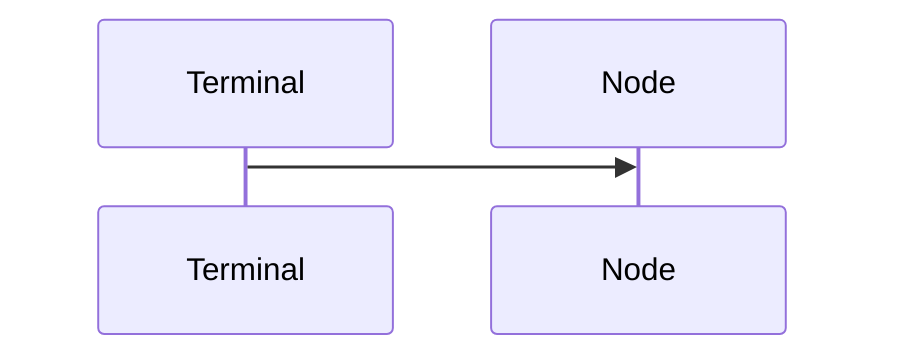
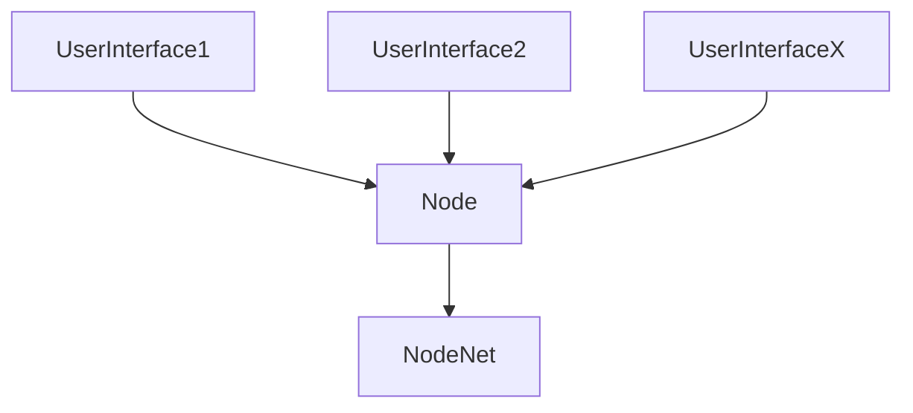

# Model

Dumb protocol

```mermaid
stateDiagram
[*] --> welcome
welcome --> log_in: if has a account
welcome --> sign_up: not has a account
sign_up --> add_new_account: if the account is not restore in device
add_new_account --> log_in: use mnemonic code or NFC 
sign_up --> new_account
note right of new_account
give away the public 
key to the user,
and restore the private 
key encrypted with 
password in device
end note
new_account --> log_in
log_in --> [*]: if password is current

```

square

penalty

success

cool

orbit

urge

install

essay

despair

chest

country

shock

```mermaid
sequenceDiagram
	Terminal ->> Node : 
	
```

聊天系统的结构

```mermaid
graph TD;
Node --> NodeNet
UserInterface1-->Node
UserInterface2-->Node
UserInterfaceX-->Node
```